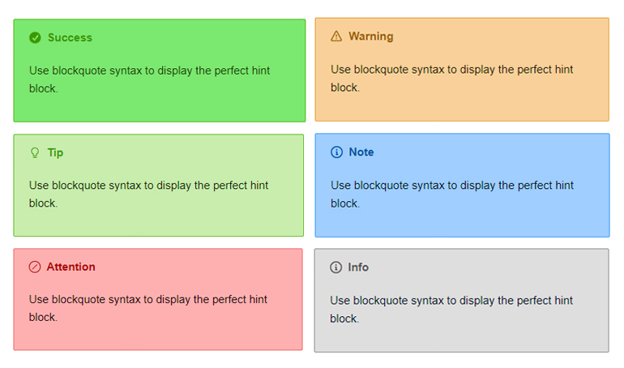

# joplin-plugin-alerts-perfect
Use blockquote syntax to display the perfect hint block.



case:

```
> [!success]
>
> Use blockquote syntax to display the perfect hint block.
```

You can also customize the title:

```
> [!success This is a prompt]
>
> Use blockquote syntax to display the perfect hint block.
```